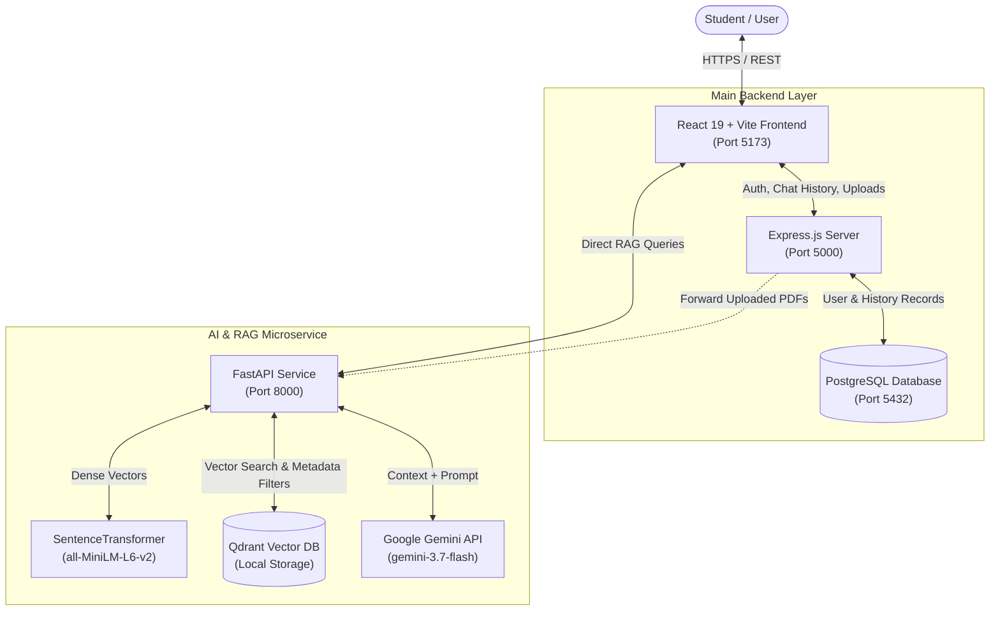
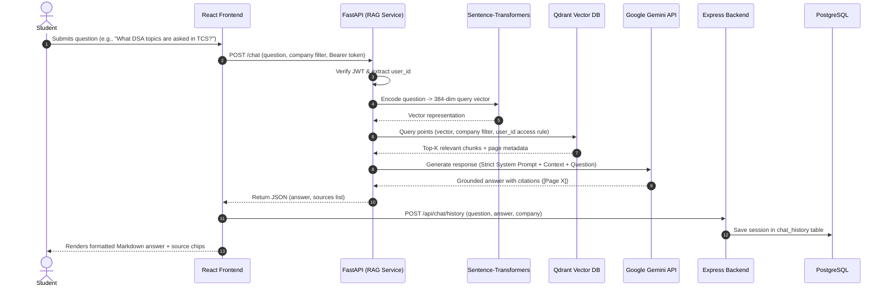

# 🎓 AI-Powered Placement Preparation Assistant

> **An intelligent, context-grounded interview preparation platform powered by Retrieval-Augmented Generation (RAG), FastAPI, Express.js, PostgreSQL, Qdrant, and React.**
> Live Frontend Preview ai-powered-placement-preparation-assistant-c3903we45.vercel.app

---

## 📌 Overview

The **AI-Powered Placement Preparation Assistant** is a full-stack platform designed to help university students and job seekers crack campus placements and off-campus tech interviews. Unlike generic conversational chatbots that are prone to hallucinations, this assistant uses **Retrieval-Augmented Generation (RAG)** to provide strictly factual, context-grounded answers citing verified campus recruitment materials, company question banks, and syllabus documents.

Students can practice and query company-specific interview patterns (e.g., **TCS**, **Amazon**, **Microsoft**, **Google**, **Infosys**, **Accenture**), explore Data Structures & Algorithms (DSA), revise core Computer Science fundamentals (DBMS, OS, OOP, Computer Networks), prepare for HR behavioral rounds, and upload their own campus placement brochures and PDFs for personalized search.

---

## 🚀 Key Features

- **🎯 Retrieval-Augmented Generation (RAG)**: Answers are generated strictly from indexed interview experiences, syllabi, and prep material using vector similarity search.
- **📑 Exact Page & Source Citations**: Every answer includes document source tags and explicit page markers (`[Page X]`) for instant verification.
- **🏢 Company-Specific Filtering**: Focus queries on target companies (TCS, Amazon, Microsoft, Google, Infosys, Accenture) or query across all companies.
- **📤 Document Hub (Custom PDF Ingestion)**: Students can upload their own placement guides and college brochures with automatic background text extraction, chunking, and vector indexing.
- **🔍 OCR-Enabled Ingestion Pipeline**: Extracts text from both digital PDFs and scanned image documents using **PyMuPDF** and **Tesseract OCR**.
- **🔐 Secure Authentication & Multi-Tenancy**: Built with **JWT** and **bcrypt** password hashing; documents and search spaces are isolated so users only access public knowledge plus their own private uploads.
- **💬 Chat History & Instant Search**: Session history is persisted in **PostgreSQL** and searchable in real time via the sidebar.
- **✨ Modern, Responsive UI**: Sleek dark-mode interface built with **React 19**, **Vite**, **Lucide Icons**, and **Markdown** formatting with code copy capabilities.

---

## 🛠️ Tech Stack Breakdown

The project follows a decoupled, multi-tier microservices architecture:

| Layer | Technology | Purpose |
| :--- | :--- | :--- |
| **Frontend** | **React.js 19** + **Vite** | Modern SPA, interactive chat, document upload hub, markdown answers |
| **Icons & Styling** | **Lucide React** + Custom CSS | Accessible icon set, dark-mode styling, responsive layout |
| **Main Backend** | **Node.js** + **Express.js** | User authentication, session management, PostgreSQL persistence, file upload handling |
| **AI / RAG Service** | **Python** + **FastAPI** | Semantic search, vector retrieval, prompt orchestration, and LLM streaming |
| **LLM Model** | **Google Gemini 3.7 Flash** / OpenAI API | Factual, grounded answer generation and source referencing |
| **Embeddings** | **Sentence-Transformers** (`all-MiniLM-L6-v2`) | Converts text chunks into dense 384-dimensional vector embeddings |
| **Vector Database** | **Qdrant** | High-performance vector indexing, cosine similarity search, and payload filtering |
| **Relational Database** | **PostgreSQL** | Relational storage for users, authentication credentials, chat history, and document metadata |
| **Document Processing** | **PyMuPDF** (`fitz`) + **Pytesseract OCR** | PDF text extraction with OCR fallback for image-heavy documents |
| **Text Chunking** | **LangChain** (`RecursiveCharacterTextSplitter`) | Chunks documents with optimal size (800 chars) and overlap (150 chars) |
| **Authentication** | **JSON Web Tokens (JWT)** + **bcryptjs** | Stateless token authentication across Express and FastAPI microservices |
| **File Upload Handling** | **Multer** | Multipart form-data handling for PDF document uploads |

---

## 🏗️ System Architecture

### High-Level Architecture



---

### End-to-End RAG Query Flow



---

## 📁 Repository Structure

```text
AI-Powered Placement Preparation Assistant/
├── backend/                        # Node.js + Express Main Backend
│   ├── routes/
│   │   ├── auth.js                 # User registration and login (JWT + bcrypt)
│   │   ├── chat.js                 # Chat history fetch and save
│   │   ├── documents.js            # PDF upload handler via Multer & RAG bridge
│   │   └── user.js                 # User profile route
│   ├── authMiddleware.js           # JWT verification middleware
│   ├── db.js                       # PostgreSQL connection pool configuration
│   ├── package.json                # Express dependencies and scripts
│   ├── server.js                   # Express server entry point (Port 5000)
│   └── uploads/                    # Local storage for uploaded PDF documents
│
├── frontend/                       # React 19 + Vite Frontend SPA
│   ├── public/                     # Static assets and icons
│   ├── src/
│   │   ├── assets/                 # App banners and brand assets
│   │   ├── App.css                 # Main responsive design and dark mode styling
│   │   ├── App.jsx                 # Main layout, chat feed, sidebar, and state
│   │   ├── index.css               # Global base styling and CSS variables
│   │   ├── Login.jsx               # Student sign-in page
│   │   ├── main.jsx                # React root application entry point
│   │   ├── Register.jsx            # Student account creation page
│   │   └── UploadDocument.jsx      # PDF drag-and-drop document upload hub
│   ├── index.html                  # HTML template
│   ├── package.json                # Frontend dependencies (React, Lucide, Markdown)
│   └── vite.config.js              # Vite bundler configuration
│
├── rag-services/                   # Python + FastAPI RAG Service
│   ├── app/
│   │   ├── ingestion/
│   │   │   ├── chunker.py          # LangChain recursive character splitter
│   │   │   ├── ingest.py           # Batch PDF processor & Qdrant ingestion CLI
│   │   │   └── pdf_loader.py       # PyMuPDF + Tesseract OCR document extractor
│   │   ├── rag/
│   │   │   ├── chain.py            # RAG orchestration, retry logic & Gemini client
│   │   │   └── prompt.py           # Strict anti-hallucination system prompt
│   │   ├── retrieval/
│   │   │   ├── embeddings.py       # SentenceTransformers embedding generation
│   │   │   └── retriever.py        # Qdrant collection setup & isolated retrieval
│   │   └── main.py                 # FastAPI application endpoints (Port 8000)
│   ├── data/
│   │   └── pdfs/                   # Global placement guides & company papers
│   ├── qdrant_data/                # Embedded Qdrant vector database storage
│   └── requirements.txt            # Python dependencies
│
├── Project Document/               # Architecture diagrams and documentation visuals
│   ├── Core Architecture.png
│   ├── Flow.png
│   ├── Frontent Architecture (1).png
│   ├── knowledge architecture.png
│   ├── Project Architecture.png
│   └── Tech Stack Table.png
│
└── README.md                       # Project documentation
```

---

## 🗄️ Database Schemas

### 1. PostgreSQL Relational Schema

```sql
-- Users Table
CREATE TABLE users (
    id SERIAL PRIMARY KEY,
    name VARCHAR(255) NOT NULL,
    email VARCHAR(255) UNIQUE NOT NULL,
    password_hash VARCHAR(255) NOT NULL,
    created_at TIMESTAMP DEFAULT CURRENT_TIMESTAMP
);

-- Chat History Table
CREATE TABLE chat_history (
    id SERIAL PRIMARY KEY,
    user_id INTEGER REFERENCES users(id) ON DELETE CASCADE,
    question TEXT NOT NULL,
    answer TEXT NOT NULL,
    company VARCHAR(100),
    created_at TIMESTAMP DEFAULT CURRENT_TIMESTAMP
);

-- User Uploaded Documents Table
CREATE TABLE user_documents (
    id SERIAL PRIMARY KEY,
    user_id INTEGER REFERENCES users(id) ON DELETE CASCADE,
    company VARCHAR(100) NOT NULL,
    file_name VARCHAR(255) NOT NULL,
    file_path TEXT NOT NULL,
    created_at TIMESTAMP DEFAULT CURRENT_TIMESTAMP
);
```

### 2. Qdrant Vector Collection

- **Collection Name**: `placement_documents`
- **Vector Dimension**: `384` (`all-MiniLM-L6-v2`)
- **Distance Metric**: `Cosine`
- **Payload Schema**:
  ```json
  {
    "text": "Chunk text content...",
    "page_number": 4,
    "chunk_index": 2,
    "document_name": "TCS_NQT_Preparation_Guide.pdf",
    "company": "TCS",
    "user_id": null
  }
  ```
  *(Note: `user_id: null` denotes global system documents available to all students. Uploaded private documents store the specific `user_id`.)*

---

## ⚙️ Installation & Setup Guide

### 1. Prerequisites

Ensure you have the following installed on your system:
- [Node.js](https://nodejs.org/) (v18 or higher) & `npm`
- [Python](https://www.python.org/) (v3.10 or higher) & `pip`
- [PostgreSQL](https://www.postgresql.org/) (v14 or higher)
- [Tesseract OCR](https://github.com/UB-Mannheim/tesseract/wiki) *(Required for scanned/image PDFs; default path on Windows: `C:\Program Files\Tesseract-OCR\tesseract.exe`)*
- A [Google AI Studio Gemini API Key](https://aistudio.google.com/)

---

### 2. Configure PostgreSQL

1. Open your PostgreSQL terminal (`psql`) or pgAdmin.
2. Create a new database named `placement_assistant`:
   ```sql
   CREATE DATABASE placement_assistant;
   ```
3. Connect to the database and run the table creation scripts detailed in the [Database Schemas](#1-postgresql-relational-schema) section.

---

### 3. Setup Main Backend (Express.js)

1. Navigate to the `backend/` directory:
   ```bash
   cd backend
   ```
2. Install npm dependencies:
   ```bash
   npm install
   ```
3. Create a `.env` file in the `backend/` directory:
   ```env
   PORT=5000
   JWT_SECRET=your_jwt_secret_key_here
   ```
   *(Update PostgreSQL credentials in `backend/db.js` if your database user or password differs).*
4. Start the Express server:
   ```bash
   # Development mode with auto-reload
   npx nodemon server.js
   # Or standard start
   node server.js
   ```
   *Express server will run on `http://localhost:5000`.*

---

### 4. Setup AI / RAG Microservice (Python & FastAPI)

1. Open a new terminal and navigate to `rag-services/`:
   ```bash
   cd rag-services
   ```
2. Create and activate a Python virtual environment:
   ```bash
   # Windows (PowerShell)
   python -m venv venv
   .\venv\Scripts\Activate.ps1

   # macOS / Linux
   python3 -m venv venv
   source venv/bin/activate
   ```
3. Install required Python packages:
   ```bash
   pip install -r requirements.txt
   ```
4. Create a `.env` file in the `rag-services/` directory:
   ```env
   GEMINI_API_KEY=your_google_gemini_api_key
   JWT_SECRET=your_jwt_secret_key_here
   ```
5. *(Optional)* Place your initial placement preparation PDFs inside `rag-services/data/pdfs/` and run the ingestion script:
   ```bash
   python -m app.ingestion.ingest
   ```
6. Start the FastAPI microservice:
   ```bash
   uvicorn app.main:app --host 127.0.0.1 --port 8000 --reload
   ```
   *FastAPI documentation will be available at `http://127.0.0.1:8000/docs`.*

---

### 5. Setup Frontend (React + Vite)

1. Open another terminal and navigate to `frontend/`:
   ```bash
   cd frontend
   ```
2. Install node dependencies:
   ```bash
   npm install
   ```
3. Start the Vite development server:
   ```bash
   npm run dev
   ```
4. Open your browser and navigate to:
   ```text
   http://localhost:5173
   ```

---

## 🔌 API Endpoints Summary

### Express.js Backend (`http://localhost:5000`)

| Method | Endpoint | Auth | Description |
| :--- | :--- | :---: | :--- |
| `POST` | `/api/auth/register` | No | Register a new student account (`name`, `email`, `password`) |
| `POST` | `/api/auth/login` | No | Authenticate student and obtain JWT token |
| `GET` | `/api/user/profile` | Yes | Retrieve current logged-in user details |
| `GET` | `/api/chat/history` | Yes | Retrieve student's prior chat question/answer records |
| `POST` | `/api/chat/history` | Yes | Persist question and answer response to history |
| `POST` | `/api/documents/upload` | Yes | Upload PDF via multipart/form-data & trigger RAG indexing |
| `GET` | `/api/health` | No | Backend service health check |

### FastAPI RAG Microservice (`http://127.0.0.1:8000`)

| Method | Endpoint | Auth | Description |
| :--- | :--- | :---: | :--- |
| `POST` | `/chat` | Yes | Accepts student question + company filter, performs vector search, and returns LLM answer with sources |
| `POST` | `/documents/process` | No | Receives document path, company, and user ID for background ingestion |
| `GET` | `/` | No | RAG microservice health check |

---

## 🔒 Security & Privacy

- **Stateless Authentication**: Protected endpoints validate standard JSON Web Tokens (`HS256`).
- **Data Isolation**: Qdrant search filters guarantee that students can only access global knowledge base materials and files they uploaded themselves.
- **Input Grounding & Anti-Hallucination**: The Gemini generation prompt strictly forbids guessing or using out-of-context knowledge, guaranteeing that all interview advice matches vetted reference materials.

---

## 💡 Future Enhancements

- [ ] **Hybrid Search**: Combining BM25 keyword search with Qdrant vector retrieval for improved precision on exact programming syntax and interview problem names.
- [ ] **Voice Interview Mode**: Real-time mock interview simulation using Speech-to-Text (STT) and Text-to-Speech (TTS).
- [ ] **Resume Analyzer & ATS Scorer**: Automated resume parsing to compare student skills against target company requirements.
- [ ] **Code Execution Playground**: In-browser code runner to test solutions for suggested DSA problems directly.

---

## 👥 Authors & Acknowledgments

- Developed for engineering students and campus job aspirants.
- Powered by Google Gemini and open-source models from Hugging Face & Sentence Transformers.
